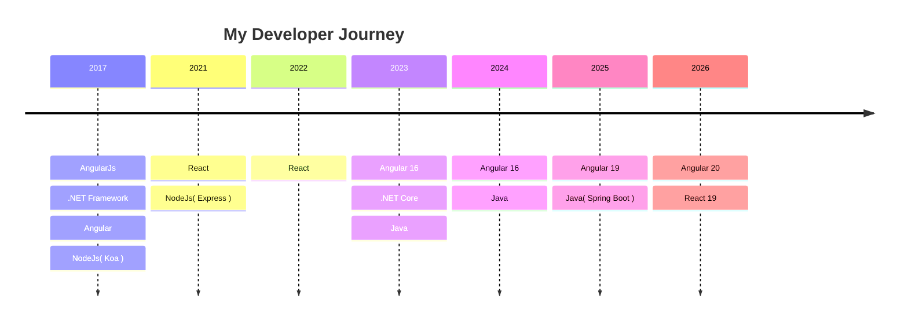

## Hi~ I'm Grady 🧃

**One of my favorite sayings is: What you learn easily, you forget easily too.  If you watch and struggle on your own, you will master the technique better.**

👨‍🍳 <a href="https://grady982.github.io/" target="_blank">My work porfolio</a>  
🍔 <a href="https://convert2webp.app/" target="_blank">Convert 2 Webp</a>  
🍟 <a href="https://convert2webp.app/" target="_blank">Laughter Official</a>  
🍕 <a href="https://convert2webp.app/" target="_blank">Ng SQL Flow</a>  
🍜 <a href="https://grady-blog.web.app/pages/posts/list" target="_blank">Blog</a>  

---

