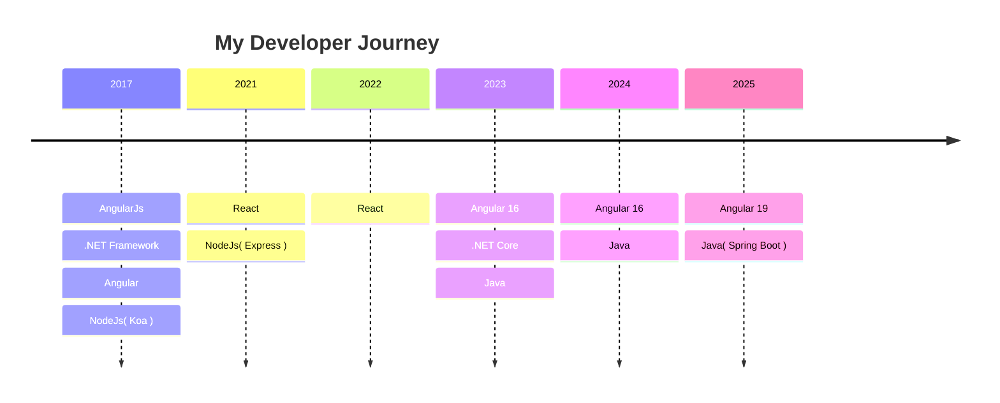

## Hi ~ I'm Grady 👋

* 🍡  <a href="https://grady-blog.web.app/pages/posts/list" target="_blank">Blog</a> 、<a href="https://grady982.github.io/" target="_blank">Portfolio</a>
* 🍜  Web Engineer, especially focus on frontend
* 🧃  What you learn easily, you forget easily too.If you watch and struggle on your own you will master the technique better
* 🧠  I'm preparing for the CKA, CKAD, and CKS certifications.

---

---

## TODO Side Projects

- Embedded SQL Flow
- Embedded Tableau Report
- EDM reader
